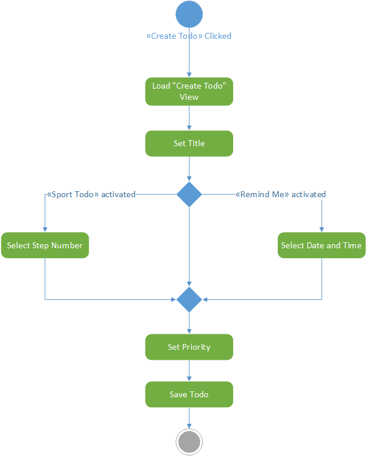
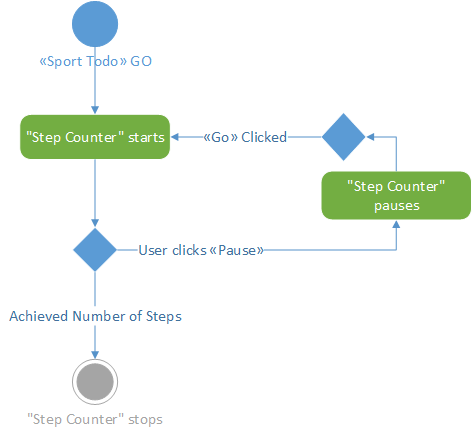
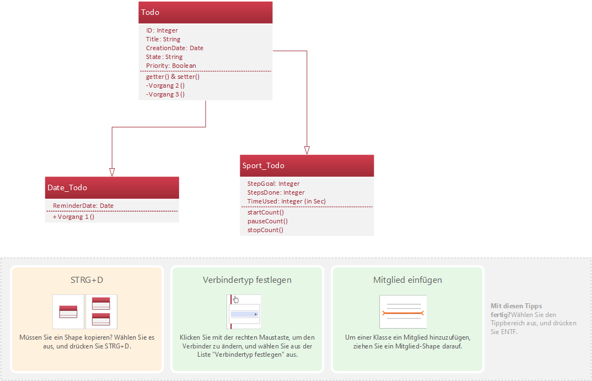

# Activity-diagram: Create Todo
The following activity diagram describes the process that is needed to create a new todo.

# Activity-diagram: Step count
The activity diagram below describes how the steps of a fitness todo are counted.

# Class-diagram: Object Structure
This class diagram shows the planned object structure for the application.

