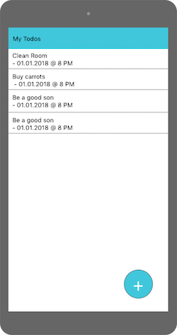
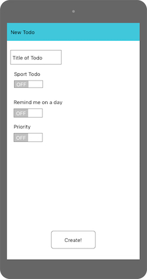

# Planung Android App
## Anforderungen an die App
- Die App muss mindestens einen Sensor und / oder einen Akkutor ansprechen
- Storyboard Aufbau mit Entwurf / Darstellung der Benutzerführung
- Funktionalität mit UML Diagramm dokumentieren

## Brainstorming mögliche Ideen
- TYPE_LIGHT: Misst umgebungslichtstärke
- TYPE_GRAVITY: Misst gravitation (Erkennt wenn geschüttelt)
- TYPE_TEMPERATURE: Misst temperatur

## Idee
- __App Name:__ Todo+
- __Idee:__ Eine Todo App im Material Desgin.
Möglichkeit ein "x-Schritte-Todo" zu erstellen.
Schritte werden in der App gezählt.
Benachrichtigung, wenn das Schritte Todo erfüllt wurde.
Erinnerung, wenn ein Todo seit langem fällig ist.
Ein Todo hat Details, welche beim Erstellen gesetzt werden können.
Sie sind, "Remind me on a day", "Priority", "Fitness Todo"

## Auftritt im Playstore
- __Titel:__ Todo+
- __Kurzbeschreibung:__ An extended Todo App. Created to help you reach your goals
- __Mockups:__

(will be replaced with screenshots as soon as the frontend is ready)

# Whitebox testing
Die App lassen wir von einem anderen Team nach diesen Cases testen.
Wir testen im Umkehrschluss ihre App, mit ihren Testcases.
|                  Test case                 | State |
|:------------------------------------------:|:-----:|
| Ein Todo erstellen                         |  :x:  |
| Fälligkeitszeitpunkt festlegen             |  :x:  |
| Schritte werden korrekt gezählt            |  :x:  |
| Priorität festlegen bei Todo               |  :x:  |
| Benachrichtigung wenn Todo fällig          |  :x:  |
| Benachrichtigung wenn Schrittzahl erreicht |  :x:  |
| Anzahl Schritte festlegen bei Sport Todo   |  :x:  |
