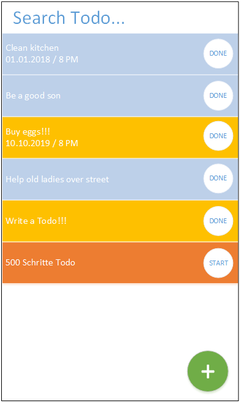
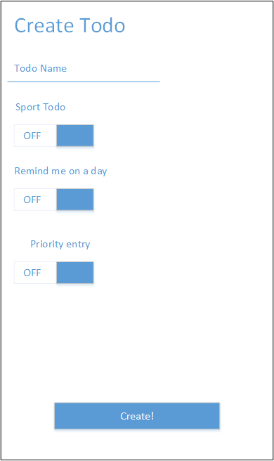

# Planung Android App
## Anforderungen an die App
- Die App muss mindestens einen Sensor und / oder einen Akkutor ansprechen
- Storyboard Aufbau mit Entwurf / Darstellung der Benutzerführung
- Funktionalität mit UML Diagramm dokumentieren

## Brainstorming: Mögliche Ideen
### Interessante Sensoren
- TYPE_LIGHT: Misst Umgebungslichtstärke
- TYPE_GRAVITY: Misst Gravitation (Erkennt wenn geschüttelt)
- TYPE_TEMPERATURE: Misst Temperatur

## Idee
- __App Name:__ Todo+
- __Idee:__ Eine Todo App im Material Desgin.
Möglichkeit ein "x-Schritte-Todo" zu erstellen. 
Die Schritte werden in der App gezählt. Der Benutzer erhält eine Benachrichtigung, wenn das Schritte Todo erfüllt wurde. 
Erinnerung, wenn ein Todo seit langem fällig ist.
Ein Todo hat Details, welche beim Erstellen mit Hilfe eines Switches gesetzt werden können.
Dazu gehören "Remind me on a day", "Priority", sowie "Fitness Todo"

## Auftritt im Playstore
- __Titel:__ Todo+
- __Kurzbeschreibung:__ An extended Todo App, created to help you reach your daily goals.
- __Mockups:__

Startseite mit diversen Todo

Neues Todo erstellen

